# Task Dependency Graph

## Batch

- Spec: `docs/ywc-plans/codex-toolkit-eval-improvements.md`
- Granularity mode: `llm`
- Starting phase: `000007`
- Rationale: existing completed tasks go through phase `000006`, so this batch starts at `000007`.

## Phase 000007 - Internal Evaluator Behavior

- `000007-010-infra-score-cli-contract` -> root
- `000007-020-test-trigger-coverage` -> depends on `000007-010-infra-score-cli-contract`

## Phase 000008 - Documentation Surface and Final Gate

- `000008-010-infra-eval-surface-validation` -> depends on `000007-010-infra-score-cli-contract`, `000007-020-test-trigger-coverage`

## Parallel Execution Notes

- Initial ready set: `000007-010-infra-score-cli-contract`
- After `000007-010-infra-score-cli-contract` merges: `000007-020-test-trigger-coverage` becomes runnable.
- After all Phase `000007` tasks merge: `000008-010-infra-eval-surface-validation` becomes runnable.
- `000007-010` and `000007-020` must not run in parallel because both may edit `tools/codex-internal/skills/ywc-codex-toolkit-eval/scripts/test_score.py`.
- `000008-010` must wait for both predecessors because it documents and validates their final behavior.

## Visual Dependency Graph

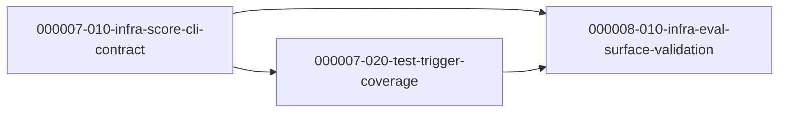

---

## Batch 2 — ywc-toolkit-eval (Claude Code) Quality Improvements

- Spec: `docs/ywc-plans/ywc-toolkit-eval-improvements.md`
- Granularity mode: `llm` · Language: korean
- Starting phase: `000009` (phases `000007`–`000008` are occupied by the codex batch above)
- Independent of the codex batch — no cross-dependency.

### Phase 000009 - Eval Scorer Fixes, Docs Alignment, Case Coverage

| Task | Category | Depends On |
| --- | --- | --- |
| `000009-010-domain-eval-scorer-logic` | domain | (root) |
| `000009-020-test-eval-scorer-unit-tests` | test | `000009-010` |
| `000009-030-docs-rubric-skill-alignment` | docs | `000009-010` |
| `000009-040-test-trigger-cases-authoring` | test | `000009-010` |
| `000009-050-infra-final-verification` | infra | `000009-010`, `-020`, `-030`, `-040` |

### Parallel Execution Notes (Batch 2)

- Initial ready set: `000009-010-domain-eval-scorer-logic` (solo — owns `score.py` + `history.mechanical.json`, atomic rebaseline).
- After `000009-010` merges: `000009-020`, `000009-030`, `000009-040` are parallel-safe (disjoint files: `test_score.py` / docs+rubric / `trigger-cases.json`).
- `000009-050` waits for all four; verification only (no source edits).
- **Hard gate (Spec Amendment A3):** `000009-010`'s A5/A7 logic change and the `history.mechanical.json` rebaseline must land in the **same commit**, or CI (`validate.yml --ci`) may go red.

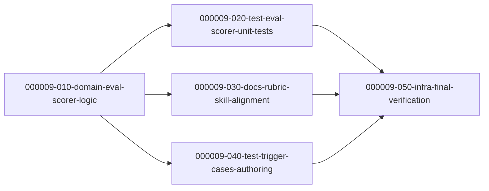

---

## Batch 3 — ywc-toolkit Activation & Boundary Fixes (Claude catalog)

- Spec: `docs/ywc-plans/ywc-toolkit-activation-fixes.md` (spec-ready DONE, 2 iterations)
- Granularity mode: `llm` · Language: korean
- Starting phase: `000010` (phases `000007`–`000009` occupied by prior batches)
- Independent of prior batches — no cross-dependency. Targets `claude-code/agents` + `claude-code/skills` descriptions only (Codex mirror deferred).

### Phase 000010 — Description / Structure Edits

| Task | Category | Depends On |
| --- | --- | --- |
| `000010-010-docs-reviewer-anti-triggers` | docs | (root) |
| `000010-020-docs-agent-dispatch-boundaries` | docs | (root) |
| `000010-030-docs-skill-anti-triggers` | docs | (root) |
| `000010-040-refactor-parallel-executor-extraction` | refactor | (root) |

### Phase 000011 — Re-baseline & Re-score (hard gate)

| Task | Category | Depends On |
| --- | --- | --- |
| `000011-010-infra-rebaseline-rescore` | infra | `000010-010`, `-020`, `-030`, `-040` |

### Parallel Execution Notes (Batch 3)

- Initial ready set: `000010-010`, `000010-020`, `000010-030`, `000010-040` are **all parallel-safe** — each owns a disjoint set of files (3 reviewer agents / qa+doc agents / 4 skill SKILL.md / parallel-executor skill). No inter-task dependency within Phase 000010.
- None of the Phase 000010 tasks edit `history.mechanical.json`; each verifies read-only with `score.py --format json` (NOT `--ci`).
- **Hard gate:** `000011-010` waits for all four Phase 000010 tasks to merge, then runs the single `score.py --ci` re-baseline + full `ywc-toolkit-eval` re-score. Re-baselining before all edits land would produce an incomplete baseline.
- FR mapping: FR1→010, FR2+FR3→020, FR4–FR7→030, FR8→040, FR9→000011-010.

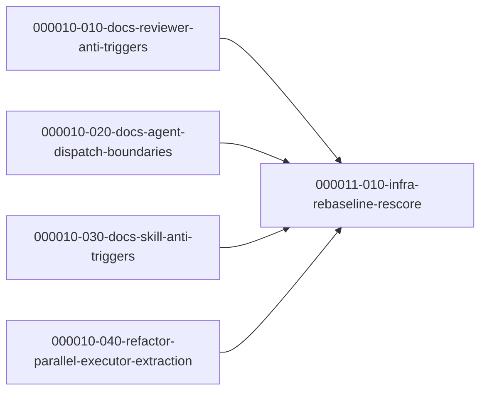

---

## Batch 4 — Codex Executor Contract-First / Test-First Skill Improvements

- Spec: `docs/ywc-plans/codex-executor-tdd-deep-module-gray-box.md`
- Granularity mode: `llm` · Language: korean
- Starting phase: `000012` (phases `000001`–`000011` occupied by existing/completed batches)
- Codex-only boundary: targets `codex/skills/**` source and generated plugin sync only; no `claude-code/**` edits.

### Phase 000012 — Shared Contract + Skill Surface Updates

| Task | Category | Depends On |
| --- | --- | --- |
| `000012-010-docs-shared-tdd-boundary-contract` | docs | (root) |
| `000012-020-docs-code-gen-contract-first` | docs | `000012-010` |
| `000012-030-docs-sequential-executor-test-first` | docs | `000012-010` |
| `000012-040-docs-parallel-executor-contract-gates` | docs | `000012-010` |

### Phase 000013 — Sync and Validation Hard Gate

| Task | Category | Depends On |
| --- | --- | --- |
| `000013-010-infra-codex-executor-contract-validation` | infra | `000012-010`, `-020`, `-030`, `-040` |

### Parallel Execution Notes (Batch 4)

- Initial ready set: `000012-010-docs-shared-tdd-boundary-contract`.
- After `000012-010` merges: `000012-020`, `000012-030`, and `000012-040` are parallel-safe because they own disjoint skill directories.
- `000013-010` waits for all Phase 000012 tasks, then runs install scan, optional generated plugin sync, and full repository validation.
- Conflict notes: the three skill tasks share only the new reference semantics and README localization expectations. They must not edit each other's skill directories.
- Hard boundary: no `claude-code/**` edits in Batch 4. Generated plugin output, if needed, belongs only to `000013-010`.
- FR mapping: FR-1→000012-010, FR-2→000012-020, FR-3→000012-030, FR-4→000012-040, FR-5→all Phase 000012 tasks, FR-6→000013-010.

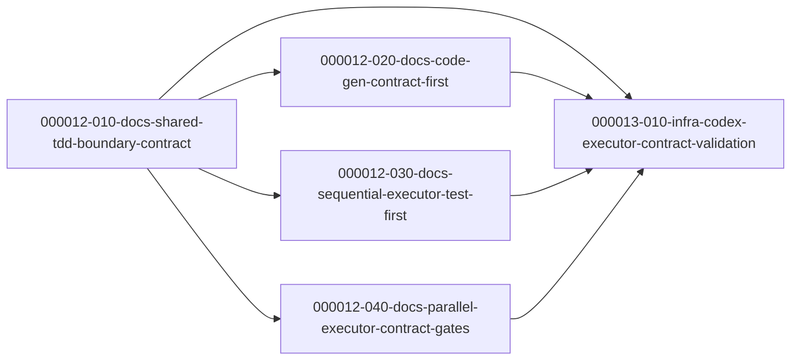

## Batch 5 — Claude Code Executor TDD / Deep Module / Gray Box Improvements

- Spec: `docs/ywc-plans/claude-code-executor-tdd-deep-module-gray-box.md`
- Granularity mode: `llm`
- Starting phase: `000014` (phases `000001`–`000013` occupied by existing/completed batches)
- Scope: claude-code only (the codex twin is Batch 4, phases `000012`–`000013`).

### Phase 000014 — Shared Reference + Skill Surface Updates

| Task | Category | Depends On |
|---|---|---|
| `000014-010-docs-shared-tdd-boundary-contract` | docs | (root) |
| `000014-020-docs-code-gen-red-gate-deep-module` | docs | `000014-010` |
| `000014-030-docs-sequential-executor-test-first` | docs | `000014-010` |
| `000014-040-docs-parallel-executor-contract-gates` | docs | `000014-010` |

### Phase 000015 — Validation Hard Gate

| Task | Category | Depends On |
|---|---|---|
| `000015-010-infra-claude-executor-contract-validation` | infra | `000014-010`, `-020`, `-030`, `-040` |

### Parallel Execution Notes (Batch 5)

- Initial ready set: `000014-010-docs-shared-tdd-boundary-contract`.
- After `000014-010` merges: `000014-020`, `000014-030`, `000014-040` are parallel-safe — each owns a disjoint `claude-code/skills/<skill>/` directory and only read-links the shared reference.
- `000015-010` is a **hard gate**: it waits for all four Phase 000014 tasks, then runs install scan + `scripts/validate.sh` + markdownlint and asserts the claude-code-only boundary.
- Hard boundary: no `codex/**` or `plugins/**` edits in Batch 5. The TDD-default divergence from Batch 4 (codex) is intentional and recorded in the spec.
- FR mapping: FR-1→000014-010, FR-2→000014-020, FR-3→000014-030, FR-4→000014-040, FR-5→all Phase 000014 tasks, FR-6→000015-010.

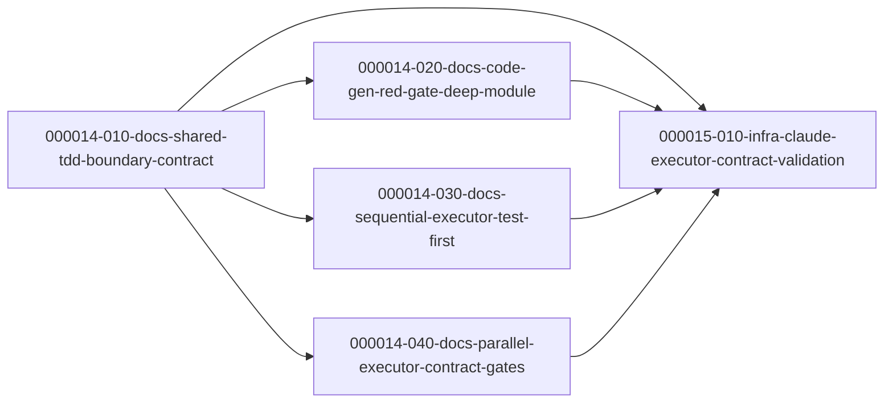

---

## Batch 6 — Codex Karpathy Guideline Integration

- Spec: `docs/ywc-plans/codex-karpathy-guideline-integration.md`
- Granularity mode: `llm` · Language: korean
- Starting phase: `000016` (phases `000001`–`000015` occupied by existing/completed batches)
- Scope: Codex skills and Codex custom agents only. Generated plugin package updates happen only through `bash scripts/sync-codex-plugin.sh`.
- Advisor pass: skipped because current tool policy allows subagent spawning only when the user explicitly requests delegation/subagents; local Pattern C phase review was applied instead.

### Phase 000016 — Source Guidance Updates

| Task | Category | Depends On |
|---|---|---|
| `000016-010-docs-principles-guideline-gap` | docs | (root) |
| `000016-020-docs-code-gen-worker-discipline` | docs | `000016-010` |
| `000016-030-docs-task-template-goal-verification` | docs | `000016-010` |
| `000016-040-docs-skill-author-future-proofing` | docs | `000016-010` |
| `000016-050-docs-custom-agent-bounded-evidence` | docs | `000016-010` |

### Phase 000017 — Sync and Validation Hard Gate

| Task | Category | Depends On |
|---|---|---|
| `000017-010-infra-codex-karpathy-validation` | infra | `000016-010`, `-020`, `-030`, `-040`, `-050` |

### Parallel Execution Notes (Batch 6)

- Initial ready set: `000016-010-docs-principles-guideline-gap`.
- After `000016-010` merges: `000016-020`, `000016-030`, `000016-040`, and `000016-050` are parallel-safe because they own disjoint source areas.
- `000017-010` is a hard gate. It waits for all Phase `000016` tasks, then runs plugin sync, full repository validation, Codex skill list, Codex agent list, targeted `rg`, and final diff scope checks.
- Conflict notes: `000016-020`, `000016-030`, and `000016-040` may each edit skill-local evals but not each other's skill directories. `000016-050` edits `codex/agents/**`, which is not synced into the plugin package.
- Hard boundary: no `claude-code/**` edits, no new `karpathy-*` skill/agent, and no manual edits to `plugins/ywc-agent-toolkit/skills/**`.
- FR mapping: FR-1→000016-010, FR-2→000016-020, FR-3→000016-030, FR-4→000016-040, FR-5→000016-050, FR-6→000016-020/030/040, FR-7→000017-010.

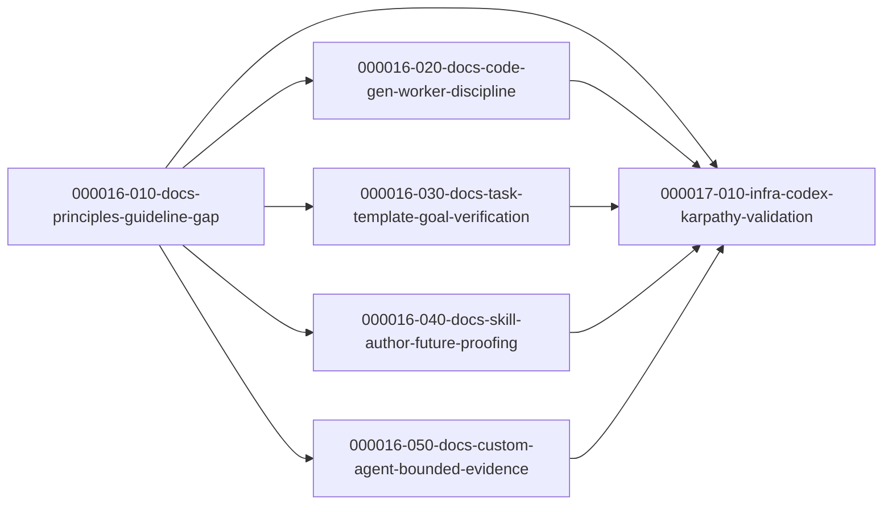

## Batch 7

- Spec: `docs/ywc-plans/claude-code-karpathy-guideline-integration.md` (DONE after spec-ready Iteration 2; Operative Sections → §Iteration 1 Amendments §A10)
- Granularity mode: `llm`
- Starting phase: `000018`
- Rationale: Codex Karpathy batch occupies `000016-010..050` + `000017-010` (active). Claude Code batch starts at `000018` to avoid collision.
- Scope: Claude Code skills/agents only. No `codex/**`, no product code, no new `karpathy-*` skill/agent.

### Phase 000018 — Karpathy Discipline Integration (foundation + parallel per-skill)

| Task | Category | Depends On |
|---|---|---|
| `000018-010-docs-principles-foundation` | docs | (root) |
| `000018-020-docs-planning-discipline` | docs | `000018-010` |
| `000018-030-docs-task-generator-goal-evals` | docs | `000018-010` |
| `000018-040-docs-surgical-simplicity-detection` | docs | `000018-010` |
| `000018-050-docs-execution-discipline` | docs | `000018-010` |

---

## Batch 8 — Codex Fable-Inspired Exploration Enhancements

- Spec: `docs/ywc-plans/fable-inspired-codex-exploration.md`
- Granularity mode: `llm` · Language: korean
- Starting phase: `000051` (highest existing phase across `tasks/dependency-graph.md` / `tasks/` / `tasks/completed/` is `000050`)
- Scope: Codex skills / references / generated Codex plugin package only. No `claude-code/**` edits in this batch.

### Phase 000051 — Shared References + Skill Surface Updates

| Task | Category | Depends On |
|---|---|---|
| `000051-010-docs-shared-exploration-references` | docs | (root) |
| `000051-020-docs-discovery-skill-exploration-hooks` | docs | `000051-010` |
| `000051-030-docs-execution-skill-implementation-notes` | docs | `000051-010` |
| `000051-040-docs-skill-author-exploration-rules` | docs | `000051-010` |

### Phase 000052 — Sync and Validation Hard Gate

| Task | Category | Depends On |
|---|---|---|
| `000052-010-infra-fable-exploration-validation` | infra | `000051-010`, `000051-020`, `000051-030`, `000051-040` |

### Parallel Execution Notes (Batch 8)

- Initial ready set: `000051-010-docs-shared-exploration-references`.
- After `000051-010` merges: `000051-020`, `000051-030`, and `000051-040` are parallel-safe because they own disjoint skill directories and only share the new reference semantics.
- `000052-010` is a **hard gate**: it waits for all Phase `000051` tasks, then runs plugin sync, repository validation, targeted grep checks, and executor line-count verification.
- Conflict notes:
  - `000051-020` must not edit `ywc-code-gen`, executor skills, or `ywc-skill-author`.
  - `000051-030` must preserve `ywc-sequential-executor/SKILL.md` and `ywc-parallel-executor/SKILL.md` at `<=500` lines.
  - `000051-040` edits only `codex/skills/ywc-skill-author/**`.
- Hard boundary: no `claude-code/**` edits, no manual edits to `plugins/ywc-agent-toolkit/skills/**`, and no new mandatory artifact for implementation notes.
- FR mapping: FR1 + FR6→`000051-010`, FR2–FR5 + FR10–FR11→`000051-020`, FR7–FR8 + FR10–FR12→`000051-030`, FR9 + FR10–FR11→`000051-040`, AC/validation hard gate→`000052-010`.

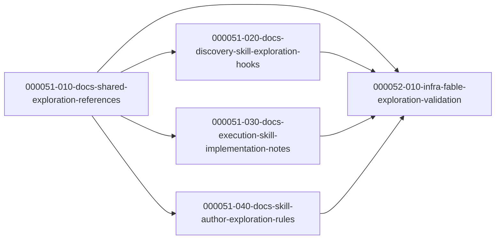

### Phase 000019 — Validation Hard Gate

| Task | Category | Depends On |
|---|---|---|
| `000019-010-infra-karpathy-validation` | infra | `000018-010`, `-020`, `-030`, `-040`, `-050` |

### Parallel Execution Notes (Batch 7)

- Initial ready set: `000018-010-docs-principles-foundation` (foundation; establishes canonical principle names in `references/principles.md`).
- After `000018-010` merges: `000018-020`, `000018-030`, `000018-040`, `000018-050` are parallel-safe — disjoint Ownership across distinct skill/agent subtrees.
- `000019-010` is a hard gate: waits for all Phase `000018`, then runs the §A5 extended `rg`, `validate.sh`, `install.sh --list --cc`, `--list --cc-agents`, and the `git diff --name-only` scope-boundary check.
- Conflict notes: the four Phase 000018 parallel tasks own disjoint areas — 020 owns spec-validate/plan/spec-writer; 030 owns task-generator (incl. evals); 040 owns impl-review + 3 language reviewers + code-gen; 050 owns parallel/sequential executors + debug-rootcause + root-cause-analyst. None overlaps. All four only *read* `references/principles.md` (edited solely by 010).
- Hard boundary: no `codex/**` edits, no new `karpathy-*` skill/agent, README sync only for the §A7 user-surface list (task-generator, spec-validate, plan, spec-writer, parallel-executor, code-gen).
- FR mapping: FR-1→000018-010, FR-2/FR-3→000018-020, FR-4/FR-12→000018-030, FR-5/FR-7→000018-040, FR-6/FR-8/FR-9/FR-10→000018-050, FR-11→000019-010.

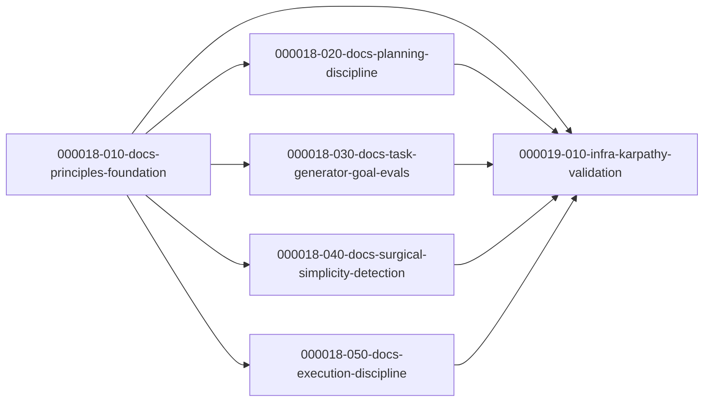

---

## Batch 8 — Codex Eval Quality Improvement Cycle

- Spec: `docs/ywc-plans/codex-eval-quality-improvement-cycle.md`
- Granularity mode: `llm`
- Starting phase: `000020`
- Scope: Codex eval report/scoreboard, selected Codex skill wording/eval fixtures, Codex agent A8 evidence strategy, generated plugin sync and validation.
- Hard boundary: no `.claude/**`, no `claude-code/**`, no product code, no dependency churn, and no manual edits to generated plugin output before `bash scripts/sync-codex-plugin.sh`.

### Phase 000020 — Evidence and Targeted Quality Improvements

| Task | Category | Depends On |
|---|---|---|
| `000020-010-docs-codex-eval-judgment-report` | docs | (root) |
| `000020-020-docs-codex-eval-scoreboard-update` | docs | `000020-010` |
| `000020-030-docs-runtime-fit-wording-polish` | docs | `000020-010` |
| `000020-040-test-eval-fixture-coverage` | test | `000020-010` |
| `000020-050-docs-agent-behavioral-evidence` | docs | `000020-010` |

### Phase 000021 — Sync and Validation Hard Gate

| Task | Category | Depends On |
|---|---|---|
| `000021-010-infra-codex-eval-sync-validation` | infra | `000020-010`, `-020`, `-030`, `-040`, `-050` |

### Parallel Execution Notes (Batch 8)

- Initial ready set: `000020-010-docs-codex-eval-judgment-report`.
- After `000020-010` merges: `000020-020`, `000020-030`, `000020-040`, and `000020-050` are parallel-safe by primary ownership, with the caveat that `000020-040` and `000020-050` may append bounded notes to the 2026-06-18 report and must merge after the report exists.
- `000020-030` and `000020-040` may both touch the `ywc-finish-branch` skill directory, but they own different files (`SKILL.md` vs `evals/evals.json`).
- `000021-010` is a hard gate: it waits for all Phase `000020` tasks, then runs plugin sync, repository validation, Codex install scans, evaluator CI, and final diff scope checks.
- FR mapping: FR-1→000020-010, FR-2→000020-020, FR-3→000020-030, FR-4→000020-040, FR-5→000020-050, FR-6→000021-010.

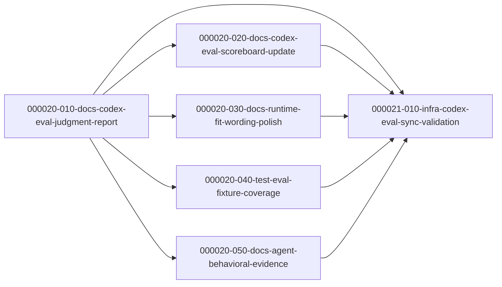

---

## Batch 9 — Toolkit-Eval Mechanical-Tier Fixes

- Spec: `plan.md` (converged via ywc-spec-ready, DONE; see `## Iteration 1 Amendments`)
- Granularity mode: `llm`
- Starting phase: `000022`
- Scope: 3 confirmed mechanical-tier skill defects (ywc-commit A4, ywc-spec-validate A2, ywc-gen-testcase A8) + eval baseline regeneration. Bundled as one llm vertical slice.
- Hard boundary: only the 3 named distributed skills + their references + `history.mechanical.json`; no other skills, no product code.

### Phase 000022 — Mechanical Findings + Baseline

| Task | Category | Depends On |
|---|---|---|
| `000022-010-docs-toolkit-eval-mechanical-fixes` | docs | (root) |

- FR mapping: FR1→ywc-commit A4, FR2→ywc-spec-validate A2, FR3→ywc-gen-testcase A8 extraction, FR4→baseline regen (intra-task final step, depends on FR1–FR3).

### Parallel Execution Notes (Batch 9)

- Single task, single phase — no intra-batch parallelism. FR4's dependency on FR1–FR3 is handled as ordered steps inside the task.
- Independent of Batch 8 (000020–000021): that batch's hard boundary excludes `.claude/**` and `claude-code/**`, so no shared-surface conflict on `history.mechanical.json` in practice.

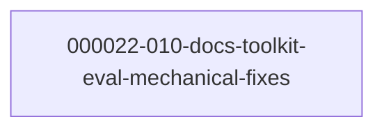

---

## Batch 10 — Codex Agent and Skill Eval Harness Improvements

- Spec: `docs/ywc-plans/codex-agent-skill-eval-harness-improvements.md`
- Spec ready log: `docs/ywc-plans/codex-agent-skill-eval-harness-improvements.spec-ready-log.md`
- Granularity mode: `llm` · Language: english
- Starting phase: `000023`
- Scope: Codex custom-agent smoke harness/evidence, missing Codex skill eval fixtures, selected Codex skill output-contract/progressive-disclosure cleanup, final Codex evaluation report and scoreboard update.
- Hard boundary: no Claude Code skills or agents, no product code, no dependency churn, no live LLM/API/runtime invocation from the validator, and no manual edits to generated plugin output before `bash scripts/sync-codex-plugin.sh`.
- Advisor pass: skipped. The skill's Pattern C advisor is optional, and current tool policy allows sub-agent spawning only when the user explicitly requests delegation/subagents; local phase-boundary review was applied instead.

### Phase 000023 — Harness, Evidence, Fixtures, and Skill Contracts

| Task | Category | Depends On |
|---|---|---|
| `000023-010-infra-agent-smoke-harness` | infra | (root) |
| `000023-020-test-agent-smoke-evidence` | test | `000023-010` |
| `000023-030-test-skill-eval-fixtures` | test | (root) |
| `000023-040-docs-codex-skill-contracts` | docs | `000023-030` |

### Phase 000024 — Final Evaluation Publication

| Task | Category | Depends On |
|---|---|---|
| `000024-010-docs-eval-report-scoreboard` | docs | `000023-010`, `000023-020`, `000023-030`, `000023-040` |

### Parallel Execution Notes (Batch 10)

- Initial ready set: `000023-010-infra-agent-smoke-harness`, `000023-030-test-skill-eval-fixtures`.
- After `000023-010` merges: `000023-020-test-agent-smoke-evidence` becomes runnable.
- After `000023-030` merges: `000023-040-docs-codex-skill-contracts` becomes runnable.
- `000023-030` and `000023-040` must not run in parallel because both touch Codex skill source directories and generated plugin sync surfaces.
- `000023-010` and `000023-030` are parallel-safe: the former owns internal evaluator scripts; the latter owns selected skill eval files and generated counterparts.
- `000023-020` and `000023-040` are parallel-safe after their respective predecessors merge: one owns agent smoke fixture/output evidence, the other owns Codex skill contract/progressive-disclosure edits.
- Phase `000024` is a hard gate. `000024-010` starts only after all Phase `000023` tasks are complete, because report and scoreboard movement require the full evidence set.
- FR mapping: FR-1/FR-3/FR-4/FR-5→`000023-010`, FR-1/FR-2→`000023-020`, FR-6→`000023-030`, FR-7/FR-8→`000023-040`, FR-9/FR-10→`000024-010`.

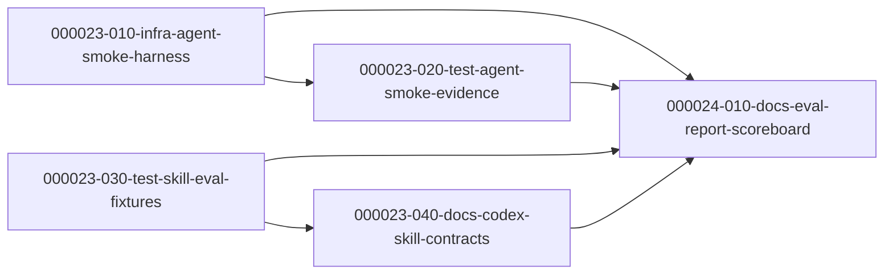

---

## Batch 11 — Tier 2: Harness-Feedback Loop & Mission Persistence

- Spec: `docs/ywc-plans/tier2-harness-feedback-and-mission-persistence.md`
- Spec ready log: `docs/ywc-plans/tier2-harness-feedback-and-mission-persistence.spec-ready-log.md`
- Granularity mode: `llm` · Language: english · Starting phase: `000025`
- Scope: harness-improvement feedback loop (debug-rootcause / incident-postmortem emit systemic-prevention into ywc-review-learnings via `--source debug|incident`) and stateful mission persistence (new `ywc-project-mission` skill + `docs/project-mission.md`, read by ywc-plan, written from ywc-brainstorm).
- Hard boundary: claude-code bundle only (no codex mirroring), markdown skill/doc edits only (no product code, no DB migration, no library introduction), propose+1-confirm apply mode.
- Advisor pass: skipped (Pattern C optional; phase boundary obvious, exactly two feature areas).
- No-AC requirements: none — every FR has a backing Acceptance Criterion.

### Phase 000025 — Foundations + Consumer Integrations (intra-phase deps via Depends On)

| Task | Category | Depends On |
|---|---|---|
| `000025-010-docs-review-learnings-prevention-sources` | docs | (root) |
| `000025-020-docs-project-mission-skill` | docs | (root) |
| `000025-030-docs-rootcause-postmortem-prevention-emit` | docs | `000025-010` |
| `000025-040-docs-mission-brainstorm-plan-integration` | docs | `000025-020` |

### Phase 000026 — Catalog & Conventions Finalization (hard gate)

| Task | Category | Depends On |
|---|---|---|
| `000026-010-docs-catalog-claude-md-integration` | docs | `000025-010`, `000025-020`, `000025-030`, `000025-040` |

### Parallel Execution Notes (Batch 11)

- Initial ready set: `000025-010` and `000025-020` — disjoint ownership, parallel-safe.
- `000025-030` runnable after `000025-010` merges (needs `--source debug|incident`); `000025-040` runnable after `000025-020` merges (needs `ywc-project-mission`). `000025-030` and `000025-040` are parallel-safe (disjoint ownership).
- Phase-gate placement: `000025-030`/`000025-040` each depend on only ONE Phase 000025 task, so per the phase-gate rule they live in Phase 000025 (ordered via Depends On), not a separate phase.
- Phase `000026` is a true hard gate: `000026-010` edits shared `claude-code/skills/README.md` + `CLAUDE.md` and starts only after ALL Phase 000025 tasks merge.
- FR mapping: FR3→`000025-010`, FR4→`000025-020`, FR1/FR2→`000025-030`, FR5/FR6→`000025-040`, FR7/AC11→`000026-010`.

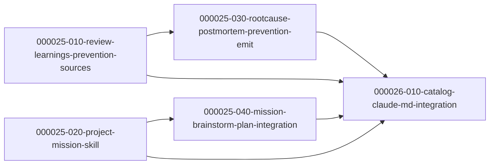

---

## Batch 12 — develop-with-llm PR 132/133/134/140 Codex Port

- Spec: `docs/ywc-plans/develop-with-llm-pr132-133-134-140-codex-port.md`
- Spec ready log: `docs/ywc-plans/develop-with-llm-pr132-133-134-140-codex-port.spec-ready-log.md`
- Granularity mode: `llm` · Language: korean · Starting phase: `000027`
- Scope: Codex source skills, Codex eval fixtures, and generated plugin sync only. No `claude-code/**` or `tools/codex-skill/**` edits.
- Advisor pass: skipped because phase boundaries are resolved by repository constraints: `codex/skills/` source changes first, generated plugin sync last.

### Phase 000027 — Codex Source Contracts, Guidance, Fixtures

| Task | Category | Depends On |
|---|---|---|
| `000027-010-refactor-plan-pr-spec-contracts` | refactor | (root) |
| `000027-020-refactor-pr-health-handler` | refactor | (root) |
| `000027-030-refactor-executor-health-sweeps` | refactor | `000027-020` |
| `000027-040-refactor-agent-context-compaction` | refactor | (root) |
| `000027-050-refactor-parity-doc-hygiene` | refactor | (root) |
| `000027-060-test-codex-parity-evals` | test | (root) |

### Phase 000028 — Generated Package and Validation Hard Gate

| Task | Category | Depends On |
|---|---|---|
| `000028-010-infra-plugin-sync-validation` | infra | `000027-010`, `000027-020`, `000027-030`, `000027-040`, `000027-050`, `000027-060` |

### Parallel Execution Notes (Batch 12)

- Initial ready set: `000027-010`, `000027-020`, `000027-040`, `000027-050`, and `000027-060` are parallel-safe because they own disjoint skill directories or eval files.
- After `000027-020` merges: `000027-030` becomes runnable because executor call sites depend on the final handler contract and helper name.
- `000028-010` is the final hard gate. It waits for all Phase `000027` tasks, then runs source checks, plugin sync, full validation, and Codex-only boundary verification.
- `000027-030` must not run in parallel with `000027-020`; the handler contract is its prerequisite.
- `000028-010` must not run in parallel with any Phase `000027` task because it owns generated plugin output for all source edits.

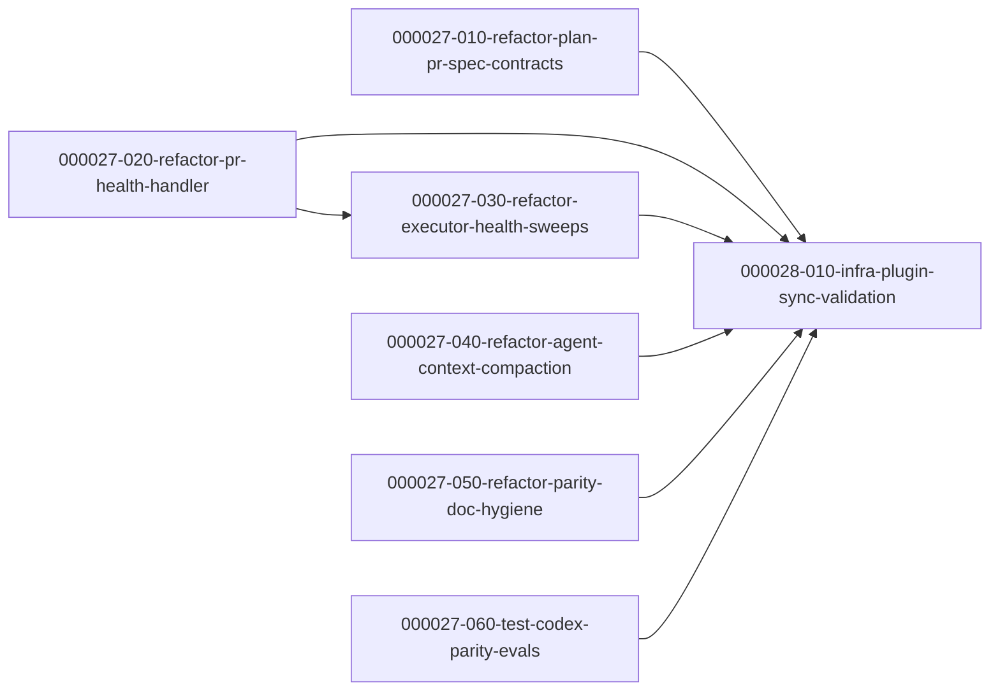

---

## Batch 13 — develop-with-llm PR 132/133/134/140 Claude Code Port

- Spec: `docs/ywc-plans/develop-with-llm-pr132-133-134-140-claude-code-port.md`
- Spec ready log: `docs/ywc-plans/develop-with-llm-pr132-133-134-140-claude-code-port.spec-ready-log.md`
- Granularity mode: `llm` · Language: korean · Starting phase: `000029`
- Scope: `claude-code/skills/**` only. The Codex twin is Batch 12 (phases `000027`–`000028`); no `codex/**` or `plugins/ywc-agent-toolkit/**` edits in this batch.
- Advisor pass: skipped — single dependency-free phase, mechanical per-skill grouping, no competing DB/library boundaries.
- No-AC requirements: none — every item traces to a backing PR change; eval/plugin-sync items are Codex-only and out of scope.

### Phase 000029 — Claude Code skill drift port (single phase, no inter-task deps)

| Task | Category | Depends On |
|---|---|---|
| `000029-010-refactor-plan-spec-contracts` | refactor | (root) |
| `000029-020-refactor-pr-health-handler` | refactor | (root) |
| `000029-030-refactor-executor-health-sweeps` | refactor | (root) |
| `000029-040-refactor-agent-context-compaction` | refactor | (root) |
| `000029-050-refactor-parity-doc-hygiene` | refactor | (root) |

- Task ↔ PR ↔ skill: 010 = #132 ywc-plan + #134 ywc-create-pr + #134/#140 ywc-spec-validate + #140 ywc-spec-writer; 020 = #133 ywc-handle-pr-reviews; 030 = #133 ywc-parallel-executor + #133/#134 ywc-sequential-executor; 040 = #134 ywc-agentic + ywc-onboard-repo; 050 = #140 ywc-gen-testcase + ywc-project-docs + ywc-project-scaffold + references/project-docs-structure.md.

### Parallel Execution Notes (Batch 13)

- Initial ready set: all five tasks — no dependencies (independent instruction/doc edits).
- Conflicts With: none. Each skill directory is owned by exactly one task. The two PR-double-touched skills are contained: `ywc-spec-validate` (#134+#140) wholly in `000029-010`; `ywc-sequential-executor` (#133+#134) wholly in `000029-030`.
- Shared Surfaces: none across tasks. All tasks share the `bash scripts/validate.sh` + markdownlint CI gates, so each must self-verify before merge.
- Hard boundary: no `codex/**` / `plugins/ywc-agent-toolkit/**` edits → pre-push hook stays green.
- Recommended execution: per the spec's single-branch intent, run `ywc-sequential-executor --local-merge` over 010→050 on one branch. Parallel worktree execution is also conflict-free.
- Adaptations from upstream (verified): 6 README locales here vs 4 upstream (add es/zh); `ywc-onboard-repo` es/zh do **not** exist → create; `ywc-agentic` README untouched (SKILL.md only); no `evals/` here (omit #140 eval additions); `ywc-gen-testcase` reference file has no `legalforce` URL (SKILL.md + READMEs only); `ywc-project-scaffold/SKILL.md` already has Rust/Axum (README-only).

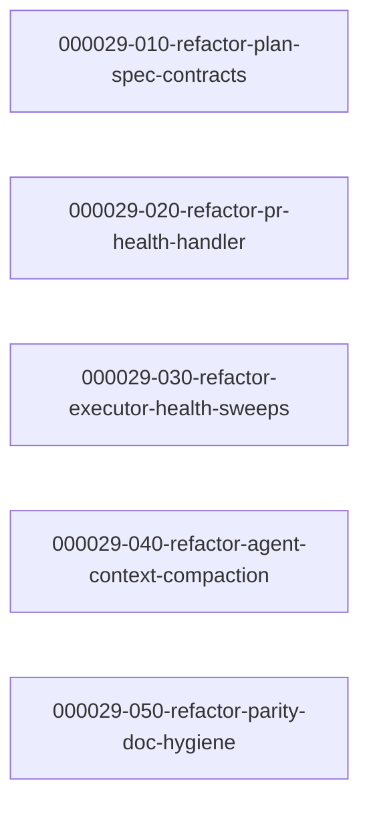

---

## Batch 14 — zh/es rollout to sibling content-output skills (claude-code)

- Spec: `docs/ywc-plans/multilang-zh-es-rollout.md`
- Granularity mode: `llm` · Language: english · Starting phase: `000030`
- Scope: `claude-code/skills/**` only. No `codex/**` or `plugins/ywc-agent-toolkit/**` edits (Codex mirror is a deliberate future follow-up).
- Prior art: `ywc-project-docs` (PR #118) — same 5-language edit shape.
- Advisor pass: skipped — single dependency-free phase, one task per skill, no competing DB/library boundaries.
- No-AC requirements: none — every task traces to spec FR1–FR4 / AC1–AC6.

### Phase 000030 — sibling skill zh/es support (single phase, no inter-task deps)

| Task | Category | Depends On |
|---|---|---|
| `000030-010-docs-spec-writer-zh-es` | docs | (root) |
| `000030-020-docs-task-generator-zh-es` | docs | (root) |
| `000030-030-docs-gen-testcase-zh-es` | docs | (root) |

- Task ↔ skill: 010 = ywc-spec-writer (SKILL.md + language-policy.md + README×6); 020 = ywc-task-generator (SKILL.md + language-policy.md + README×6, word-style flags `chinese`/`spanish`); 030 = ywc-gen-testcase (SKILL.md inline + README×6, no policy file, + W1 technical-term-in-English rule).

### Parallel Execution Notes (Batch 14)

- Initial ready set: all three tasks — no dependencies (independent per-skill doc edits).
- Conflicts With: none. Each skill directory is owned by exactly one task; disjoint file ownership.
- Shared Surfaces: none across tasks. All share the `bash scripts/validate.sh` + markdownlint CI gates, so each must self-verify before merge.
- Hard boundary: no `codex/**` / `plugins/ywc-agent-toolkit/**` edits → pre-push hook stays green.
- Recommended execution: `ywc-sequential-executor --local-merge` over 010→030 on one branch, or conflict-free parallel worktrees.
- Adaptations: keep each skill's own `--lang` code convention (spec-writer/gen-testcase `zh`/`es`; task-generator word-style `chinese`/`spanish`). gen-testcase has no policy file — inline rules only. No `evals/` in claude-code (omit eval additions).

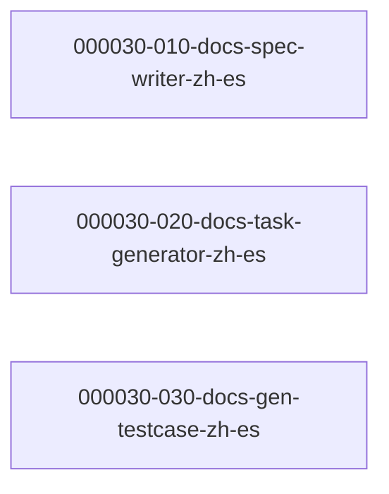

---

## Batch 15 — Codex language-aware skills zh/es support

- Spec: `docs/ywc-plans/ywc-skills-zh-es-language-support.md`
- Spec ready log: `docs/ywc-plans/ywc-skills-zh-es-language-support.spec-ready-log.md`
- Granularity mode: `llm` · Language: korean · Starting phase: `000031`
- Scope: `codex/skills/**` source edits and generated `plugins/ywc-agent-toolkit/skills/**` sync only. No `claude-code/**` edits.
- Existing phase note: Phase `000030` is occupied by the separate Claude Code zh/es batch, so this Codex-only batch starts at `000031`.
- Advisor pass: skipped. Phase boundaries are mechanically determined by source-edit tasks first and generated plugin sync/validation last.

### Phase 000031 — Codex source language contracts

| Task | Category | Depends On |
|---|---|---|
| `000031-010-docs-spec-writer-codex-zh-es` | docs | (root) |
| `000031-020-docs-task-generator-codex-zh-es` | docs | (root) |
| `000031-030-docs-gen-testcase-codex-zh-es` | docs | (root) |
| `000031-040-docs-pr-creation-language-zh-es` | docs | (root) |
| `000031-050-docs-executor-pr-lang-zh-es` | docs | (root) |
| `000031-060-docs-pr-review-reply-zh-es` | docs | (root) |

### Phase 000032 — Generated package sync and validation hard gate

| Task | Category | Depends On |
|---|---|---|
| `000032-010-infra-codex-plugin-sync-validation` | infra | `000031-010`, `000031-020`, `000031-030`, `000031-040`, `000031-050`, `000031-060` |

### Parallel Execution Notes (Batch 15)

- Initial ready set: all Phase `000031` tasks. They own disjoint Codex skill directories and can run in parallel.
- `000031-040` and `000031-050` share the conceptual PR language contract but do not share file Ownership; they are parallel-safe.
- `000032-010` is a hard gate. It waits for all Phase `000031` tasks, runs `bash scripts/sync-codex-plugin.sh`, validates eval JSON, runs targeted skill validation, then runs `bash scripts/validate.sh`.
- `000032-010` must not run in parallel with any Phase `000031` task because it owns generated plugin output for all source edits.
- Hard boundary: no `claude-code/**` edits in this batch. If Claude parity is needed later, create a separate plan/task set.

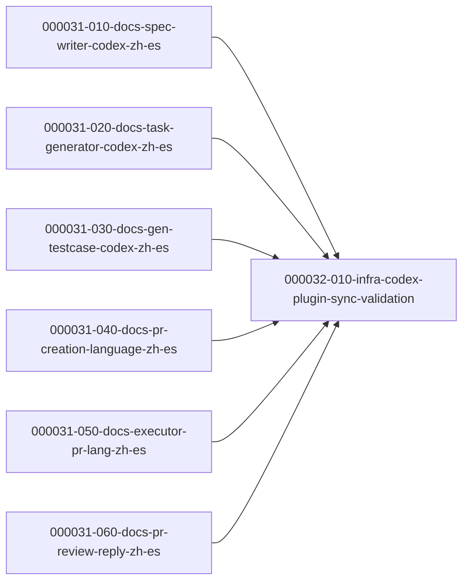

---

## Batch 16 — Codex Data Integrity Skill Hardening

- Spec: `docs/ywc-plans/codex-data-integrity-skill-hardening.md`
- Granularity mode: `llm` · Language: korean · Starting phase: `000033`
- Scope: Codex skills only. Generated plugin package updates happen only through `bash scripts/sync-codex-plugin.sh`.
- Existing phase note: phases `000030` through `000032` are already occupied by the zh/es rollout batches, so this batch starts at `000033`.
- Advisor pass: skipped. Phase boundaries are straightforward source guidance slices plus one validation hard gate.

### Phase 000033 — Source Guidance Updates

| Task | Category | Depends On |
|---|---|---|
| `000033-010-docs-impl-review-integrity-catalog` | docs | (root) |
| `000033-020-docs-spec-task-integrity-guidance` | docs | `000033-010` |
| `000033-030-docs-executor-integrity-gates` | docs | `000033-010` |

### Phase 000034 — Sync and Validation Hard Gate

| Task | Category | Depends On |
|---|---|---|
| `000034-010-infra-codex-integrity-validation` | infra | `000033-010`, `000033-020`, `000033-030` |

### Parallel Execution Notes (Batch 16)

- Initial ready set: `000033-010-docs-impl-review-integrity-catalog`.
- After `000033-010` merges: `000033-020` and `000033-030` are parallel-safe because they own disjoint skill directories.
- `000034-010` waits for all Phase `000033` tasks, then runs targeted evidence search, optional generated plugin sync, install list scan, and full repository validation.
- Conflict notes: no task may edit `plugins/ywc-agent-toolkit/skills/**` directly before `000034-010`; generated package sync belongs only to the validation hard gate.
- Hard boundary: no `claude-code/**` edits in Batch 16.
- FR mapping: FR-1+FR-2 -> `000033-010`; FR-3+FR-4 -> `000033-020`; FR-5 -> `000033-030`; FR-6 + AC5 + AC6 -> `000034-010`.

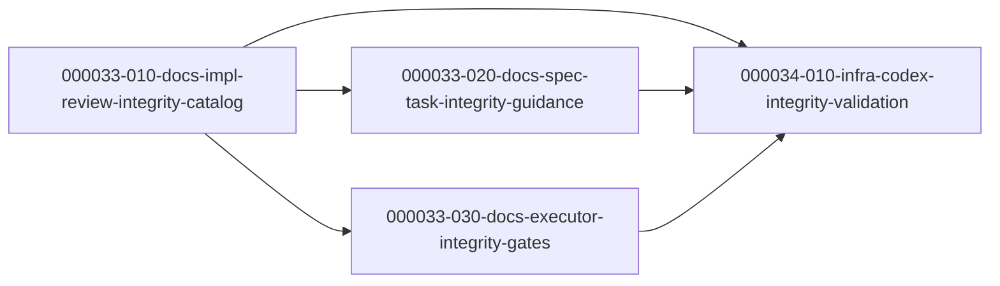

---

## Batch 17 — Claude Code Data Integrity Skill Hardening

- Spec: `docs/ywc-plans/claude-code-data-integrity-skill-hardening.md` (spec-ready DONE, 1 iteration; W1–W6 pre-applied from the Batch 16 review)
- Spec ready log: `docs/ywc-plans/claude-code-data-integrity-skill-hardening.spec-ready-log.md`
- Granularity mode: `llm` · Language: korean · Starting phase: `000035`
- Scope: `claude-code/skills/**` only. The **claude-code twin of Batch 16** (Codex, phases `000033`–`000034`). No `codex/**` or `plugins/ywc-agent-toolkit/**` edits.
- Existing phase note: phases `000033`–`000034` are occupied by the Codex data-integrity batch (Batch 16), so this batch starts at `000035`.
- Advisor pass: skipped — phase structure mirrors Batch 16 (source guidance slices → one validation hard gate); local Pattern C review applied.
- No-AC requirements: none — every FR (FR-1…FR-6) has a backing Acceptance Criterion (AC1…AC8).
- Divergence from Batch 16: FR-5 (executor) is reduced to a **single Rationalization-Defense row per executor** (not full prose), because both executors already run Task Verify as an unconditional Layer-1 gate — full prose would restate existing behavior (spec W2).

### Phase 000035 — Source Guidance Updates

| Task | Category | Depends On |
|---|---|---|
| `000035-010-docs-impl-review-integrity-catalog` | docs | (root) |
| `000035-020-docs-spec-task-integrity-guidance` | docs | `000035-010` |
| `000035-030-docs-executor-integrity-gates` | docs | `000035-010` |

### Phase 000036 — Validation Hard Gate

| Task | Category | Depends On |
|---|---|---|
| `000036-010-infra-claude-integrity-validation` | infra | `000035-010`, `000035-020`, `000035-030` |

### Parallel Execution Notes (Batch 17)

- Initial ready set: `000035-010-docs-impl-review-integrity-catalog` (establishes canonical write-consistency terminology + severity mapping in `recurring-defects.md`).
- After `000035-010` merges: `000035-020` and `000035-030` are parallel-safe — disjoint Ownership (`ywc-spec-validate` + `ywc-task-generator` vs the two executors). Both depend on `000035-010` only for terminology consistency, so per the phase-gate rule they live in Phase 000035 (ordered via Depends On), not a separate phase.
- `000036-010` is a hard gate: waits for all Phase 000035 tasks, then runs the targeted `rg` evidence sweep, `scripts/validate.sh`, markdownlint on changed READMEs, and the `git diff --name-only` claude-code-only boundary check. Unlike the Codex twin, there is **no generated-plugin sync** (claude-code has no plugin package).
- Conflict notes: each of the three Phase 000035 tasks owns a disjoint skill-directory set; none edits another's directory. All share the `bash scripts/validate.sh` + markdownlint CI gates, so each self-verifies before merge.
- Hard boundary: no `codex/**` / `plugins/ywc-agent-toolkit/**` edits → pre-push hook stays green.
- Recommended execution: `ywc-sequential-executor --local-merge` over 010→020→030→(036-010) on one branch, or conflict-free parallel worktrees for 020/030 after 010 merges.
- FR mapping: FR-1+FR-2 → `000035-010`; FR-3+FR-4 → `000035-020`; FR-5 → `000035-030`; FR-6 + AC7 + AC8 → `000036-010`.


---

## Batch 18 — ywc Language Setup (claude-code)

- Spec: `docs/ywc-plans/ywc-language-setup.md` (ywc-spec-validate → DONE after 2 iterations)
- Spec ready log: `docs/ywc-plans/ywc-language-setup.spec-ready-log.md`
- Granularity mode: `llm` · Language: korean · Starting phase: `000037`
- Scope: `claude-code/skills/**` only. Codex 런타임 제외(spec Out of Scope).
- Existing phase note: 최고 기존 phase 는 `000036`(Batch 17), 따라서 이 batch 는 `000037` 에서 시작.
- Advisor pass: skipped — phase 경계가 명확(foundation reference → build → validation hard gate); Medium 규모, local Pattern C 판단.
- No-AC requirements: 없음 — 모든 task 가 FR/AC 로 추적됨.
- Safety invariants: DB migration / library introduction 없음 → 강제 split 없음.

### Phase 000037 — Foundation (canonical resolution reference)

| Task | Category | Depends On |
|---|---|---|
| `000037-010-docs-language-resolution-reference` | docs | (root) |

### Phase 000038 — Build on foundation (parallel-safe)

| Task | Category | Depends On |
|---|---|---|
| `000038-010-docs-ywc-setup-language-skill` | docs | `000037-010` |
| `000038-020-docs-wire-doc-generator-consumers` | docs | `000037-010` |
| `000038-030-docs-wire-git-artifact-consumers` | docs | `000037-010` |

### Phase 000039 — Validation Hard Gate

| Task | Category | Depends On |
|---|---|---|
| `000039-010-infra-validate-language-setup` | infra | `000038-010`, `000038-020`, `000038-030` |

### Parallel Execution Notes (Batch 18)

- Initial ready set: `000037-010-docs-language-resolution-reference` (canonical `references/language-resolution.md` + `CLAUDE.md` 문서화 섹션 — 이후 모든 task 의 참조 대상).
- After `000037-010` merges: `000038-010` / `000038-020` / `000038-030` 은 병렬 안전 — Ownership 이 disjoint(신규 skill 디렉토리 vs task-generator/spec-writer/plan SKILL.md vs create-pr/commit SKILL.md). 셋 다 `000037-010` 에만 의존하므로 phase-gate 규칙상 같은 Phase 000038 에 두고 Depends On 으로만 정렬.
- `000039-010` 은 hard gate: Phase 000038 전부 완료 후 `scripts/validate.sh` + `install.sh --list --cc` + consumer wiring 확인을 실행. 파일 편집 없음(검증 전용).
- Conflict notes: `000037-010` 만 `CLAUDE.md` 를 편집(단독). `000038-020` 과 `000038-030` 은 disjoint SKILL.md set. 병렬 편집 충돌 없음.
- Hard boundary: `codex/**` 편집 없음 → pre-push hook green.
- Recommended execution: `000037-010` merge 후 `000038-010/020/030` 을 conflict-free 병렬 worktree(`ywc-parallel-executor`), 이후 `000039-010`.
- FR mapping: FR2+FR9(A1/A2/A5)+AC12 → `000037-010`; FR1+FR8+AC1–4+AC11 → `000038-010`; FR3+FR4(A4)+FR5+AC5/AC8–10+EC8 → `000038-020`; FR6+FR7+AC6/AC7 → `000038-030`; AC11 최종+FR8 → `000039-010`.
- Open Questions (spec OQ, non-blocking): OQ1 skill 이름(`ywc-setup-language` 로 확정, `000038-010` 에서 재확인), OQ2 user-global `~/.claude/CLAUDE.md` 생성 시 확인 방식(`000038-010` author 시 결정).

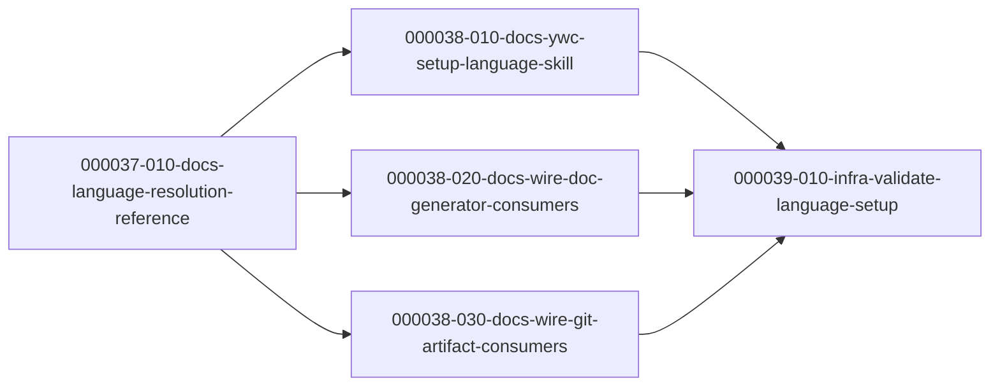

---

## Batch 19 — Codex YWC Language Setup

- Spec: `docs/ywc-plans/codex-ywc-language-setup.md` (spec-ready DONE, 1 iteration)
- Spec ready log: `docs/ywc-plans/codex-ywc-language-setup.spec-ready-log.md`
- Granularity mode: `llm` · Language: korean · Starting phase: `000040`
- Scope: Codex skills, Codex shared references, Codex/root catalog documentation, and generated plugin sync only. No `claude-code/**` edits.
- Existing phase note: highest active phase is `000039` (Batch 18), so this Codex batch starts at `000040`.
- Advisor pass: skipped due current tool policy requiring explicit subagent authorization; local Pattern C phase review applied. Phase boundaries are straightforward: foundation reference → parallel source/doc wiring → sync/validation hard gate.
- Safety invariants: DB migration / library introduction 없음.

### Phase 000040 — Foundation

| Task | Category | Depends On |
|---|---|---|
| `000040-010-docs-codex-language-resolution-reference` | docs | (root) |

### Phase 000041 — Codex Source and Catalog Updates

| Task | Category | Depends On |
|---|---|---|
| `000041-010-docs-codex-ywc-setup-skill` | docs | `000040-010` |
| `000041-020-docs-wire-artifact-language-consumers` | docs | `000040-010` |
| `000041-030-docs-wire-pr-orchestration-consumers` | docs | `000040-010` |
| `000041-040-docs-catalog-language-setup` | docs | `000040-010` |

### Phase 000042 — Sync and Validation Hard Gate

| Task | Category | Depends On |
|---|---|---|
| `000042-010-infra-codex-language-setup-validation` | infra | `000041-010`, `000041-020`, `000041-030`, `000041-040` |

### Parallel Execution Notes (Batch 19)

- Initial ready set: `000040-010-docs-codex-language-resolution-reference`.
- After `000040-010` merges: `000041-010`, `000041-020`, `000041-030`, and `000041-040` are parallel-safe. They own disjoint areas: new `ywc-setup` skill directory, artifact consumer skill directories, PR/orchestration skill directories, and catalog/root docs.
- `000042-010` is a hard gate. It waits for all Phase `000041` tasks, then runs generated plugin sync if needed, full repository validation, Codex install list verification, and targeted language wiring checks.
- Conflict notes: no task before `000042-010` may manually edit `plugins/ywc-agent-toolkit/skills/**`; generated package sync belongs only to the validation hard gate. Phase `000041` tasks only read `codex/skills/references/language-resolution.md`.
- Hard boundary: no `claude-code/**` edits in Batch 19.
- Recommended execution: run `000040-010`, then execute the four Phase `000041` tasks in parallel worktrees, then run `000042-010`.
- FR mapping: FR-4 → `000040-010`; FR-1/FR-2/FR-3 → `000041-010`; FR-5 artifact consumers + FR-6 explicit flag preservation → `000041-020`; FR-5 PR/orchestration consumers + FR-6 → `000041-030`; FR-7 → `000041-040`; AC10 + sync/validation → `000042-010`.

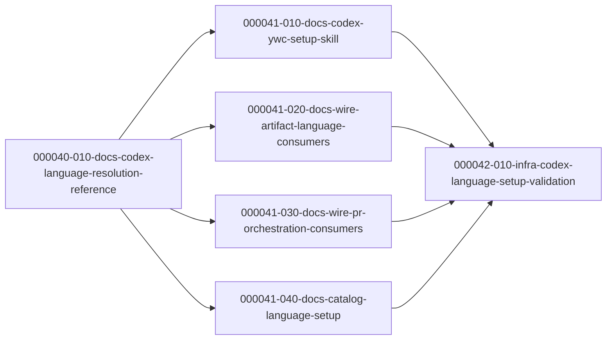

### Phase 000043 — Toolkit-Eval 2026-07-06 개선 백로그 (Batch 20)

| Task | Category | Depends On |
|---|---|---|
| `000043-010-test-setup-language-trigger-cases` | test | (root) |
| `000043-020-docs-skill-body-anti-trigger-fixes` | docs | (root) |
| `000043-030-docs-agent-test-ownership-boundaries` | docs | (root) |

### Parallel Execution Notes (Batch 20)

- Source spec: `docs/ywc-plans/toolkit-eval-backlog-2026-07-06.md` (DONE, Iteration 1 Amendments 권위본). Mode: `llm`. Lang: `ko`.
- 단일 Phase. Ownership이 완전 분리됨. `000043-020` / `000043-030`는 상호 무의존이라 **즉시 병렬 실행 가능**하나, `000043-010`은 OQ1(collision 형제 확정) 해소 후에만 착수 가능:
  - `000043-010` → `.claude/skills/ywc-toolkit-eval/evals/trigger-cases.json`
  - `000043-020` → `claude-code/skills/{project-docs,project-scaffold,merge-dependabot,product-review,tdd-ritual}/SKILL.md` + `codex/skills/{동일}` 미러
  - `000043-030` → `claude-code/agents/{backend-coder,frontend-coder,qa-engineer,doc-writer}.md`
- Conflict notes: 세 태스크의 파일 집합은 교집합이 없음. `000043-020`만 Codex 미러 sync 게이트(`.githooks/pre-commit`, `scripts/validate.sh`)를 공유하나 다른 태스크와 충돌하지 않음. `plugins/ywc-agent-toolkit/**` 수기 편집 금지(sync/훅 위임).
- FR mapping: FR1 → `000043-010`; FR2~FR6 + FR11 → `000043-020`; FR7~FR10 → `000043-030`.
- 재평가는 세 태스크 병합 후 별도 `ywc-toolkit-eval` 실행으로 확인(본 배치의 완료 조건 아님; Out of Scope).

### Open Questions (from ywc-plan / spec, 착수 전 해소 권장)

- **OQ1 (BLOCKING for `000043-010`)**: `ywc-setup-language`의 collision 형제 미확정. 권장 `ywc-project-mission`;
  진짜 경합 형제가 없으면 eval 소유자가 커버리지 규칙(collision≥2) 예외를 승인해야 함. **미해소 시 `000043-010`
  착수 불가** (해당 task.md Prerequisites/Stop Condition에 반영됨).
- **OQ2 (non-blocking, `000043-020` 내부)**: FR5(product-review :26)는 실편집 대신 "비결함 기록"이 근거상 타당.
  미결이면 "비결함 기록"으로 진행.

```mermaid
graph LR
  BA[000043-010-test-setup-language-trigger-cases]
  BB[000043-020-docs-skill-body-anti-trigger-fixes]
  BC[000043-030-docs-agent-test-ownership-boundaries]
```

---

## Batch — infra-skill-suite (000044–000046)

- Spec: `docs/ywc-plans/infra-skill-suite-design.md` (spec-ready DONE, 2/5 iterations)
- Mode: `llm` · Lang: `ko`
- Goal: 인프라 스킬 4종(design/iac-author/review/optimize) + 워커 에이전트 `ywc-cloud-engineer` 신규 + security/performance 에이전트 확장. Terraform 단일 고정, 프로바이더 4종(AWS/GCP/Azure/K8s).

### Phase 000044 — Foundation (worker + shared refs)
- `000044-010-infra-cloud-engineer-agent` — (deps: 없음)
- `000044-020-docs-infra-shared-references` — (deps: 없음)

### Phase 000045 — Skills + agent extensions (hard gate: Phase 000044 완료)
- `000045-010-infra-agent-lens-extensions` → `000044-020`
- `000045-020-docs-iac-author-skill` → `000044-010`, `000044-020`
- `000045-030-docs-infra-design-skill` → `000044-020`
- `000045-040-docs-infra-review-skill` → `000044-010`, `000044-020`, `000045-010`
- `000045-050-docs-infra-optimize-skill` → `000044-010`, `000044-020`

### Phase 000046 — Packaging + validation (hard gate: Phase 000045 완료)
- `000046-010-infra-codex-plugin-sync-validate` → 모든 `000045-*`

### 실행 순서 (arrow notation)
```
000044-010 ─┐
000044-020 ─┼─▶ 000045-010 ─▶ 000045-040
            ├─▶ 000045-020
            ├─▶ 000045-030
            └─▶ 000045-050
                 (all 000045-*) ─▶ 000046-010
```

### Parallel Execution Notes
- Phase 000044: `010`(에이전트 파일)과 `020`(references)는 파일 집합 무교집합 → 병렬 안전.
- Phase 000045: `020/030/050`은 각기 다른 스킬 디렉터리 → 병렬 안전. `010`(에이전트 확장)은 `040`(infra-review)의 선행 — SEQUENCE 순서 준수. `040`은 `010` 머지 후 착수.
- Phase 000046: `plugins/**`·`.codex-plugin/plugin.json` 전역 매니페스트 재생성 → **단독 실행**, 모든 000045 머지 후.
- `plugins/ywc-agent-toolkit/**`는 `codex/skills`에서 생성되는 미러 → 수기 편집 금지(pre-commit 훅 위임).

### Open Questions (착수 전 확인 권장, non-blocking)
- **OQ1 (`000044-020` 내부)**: 공유 references 저장 위치 — 각 스킬 `references/` 복제(a) vs `claude-code/skills/references/`+`codex/skills/references/` 공유(b). 기본안 (b). CC 설치 시 공유 refs 배포 여부 확인 필요.
- **OQ2 (`000045-020` `category`)**: 스펙 §0의 `category: implement`는 신규 값(기존 13종에 없음). enum 검증 대상 아니므로 non-blocking. 저작 시 기존 값 재사용 또는 의도적 신규 채택 확인.

```mermaid
graph LR
  A1[000044-010-cloud-engineer-agent]
  A2[000044-020-shared-references]
  B1[000045-010-agent-lens-extensions]
  B2[000045-020-iac-author-skill]
  B3[000045-030-infra-design-skill]
  B4[000045-040-infra-review-skill]
  B5[000045-050-infra-optimize-skill]
  C1[000046-010-codex-plugin-sync-validate]
  A2 --> B1 --> B4
  A1 --> B2
  A2 --> B2
  A2 --> B3
  A1 --> B4
  A2 --> B4
  A1 --> B5
  A2 --> B5
  B1 --> C1
  B2 --> C1
  B3 --> C1
  B4 --> C1
  B5 --> C1
```

---

## Batch — Codex Infra Skill Suite Port (000047–000050)

- Spec: `docs/ywc-plans/codex-infra-skill-suite-port.md`
- Granularity mode: `llm` · Language: korean
- Starting phase: `000047` (existing active/completed batches already occupy phases through `000046`)
- Scope: Codex-only. Targets `codex/skills/**`, `codex/agents/**`, and generated plugin sync only. No `claude-code/**` edits.
- Advisor pass: used (`ywc-architect`) to tighten phase gates, split shared references, and verify no hidden dependency cycle.

### Phase 000047 — Agent Contract Surfaces

| Task | Category | Depends On |
|---|---|---|
| `000047-010-infra-cloud-engineer-specialist` | infra | (root) |
| `000047-020-infra-agent-lens-extensions` | infra | (root) |

### Phase 000048 — Shared Infra References

| Task | Category | Depends On |
|---|---|---|
| `000048-010-docs-infra-reference-core` | docs | `000047-010`, `000047-020` |
| `000048-020-docs-infra-provider-packs` | docs | `000048-010` |

### Phase 000049 — Codex Skill Authoring

| Task | Category | Depends On |
|---|---|---|
| `000049-010-docs-iac-author-skill` | docs | `000047-010`, `000048-010`, `000048-020` |
| `000049-020-docs-infra-design-skill` | docs | `000048-010`, `000048-020` |
| `000049-030-docs-infra-review-skill` | docs | `000047-010`, `000047-020`, `000048-010`, `000048-020` |
| `000049-040-docs-infra-optimize-skill` | docs | `000047-010`, `000048-010`, `000048-020` |

### Phase 000050 — Plugin Sync and Validation Hard Gate

| Task | Category | Depends On |
|---|---|---|
| `000050-010-infra-codex-plugin-sync-validate` | infra | `000047-010`, `000047-020`, `000048-010`, `000048-020`, `000049-010`, `000049-020`, `000049-030`, `000049-040` |

### Parallel Execution Notes

- Initial ready set: `000047-010-infra-cloud-engineer-specialist`, `000047-020-infra-agent-lens-extensions` are parallel-safe because they edit disjoint agent files.
- `000048-010-docs-infra-reference-core` waits for both Phase `000047` tasks so shared terminology aligns with final agent-routing language.
- `000048-020-docs-infra-provider-packs` must not run in parallel with `000048-010` because both own `codex/skills/references/infra/**` and share the same terminology contract.
- After all Phase `000048` tasks merge: `000049-010`, `000049-020`, `000049-030`, and `000049-040` are parallel-safe because each owns a disjoint `codex/skills/<skill>/**` subtree.
- `000049-030` also depends on both `000047` tasks because its dispatch names must match the finalized specialist agent contracts.
- `000050-010` is a hard gate. It waits for every prior source task, then runs plugin sync, repository validation, install/list checks, and Codex-only scope verification.
- Mid-plan spot-check: `000048-020` runs `bash scripts/validate.sh` once after provider-pack authoring to catch structure drift before skill writing.

```mermaid
graph LR
  A1[000047-010-infra-cloud-engineer-specialist] --> B1[000048-010-docs-infra-reference-core]
  A2[000047-020-infra-agent-lens-extensions] --> B1
  B1 --> B2[000048-020-docs-infra-provider-packs]
  A1 --> C1[000049-010-docs-iac-author-skill]
  B1 --> C1
  B2 --> C1
  B1 --> C2[000049-020-docs-infra-design-skill]
  B2 --> C2
  A1 --> C3[000049-030-docs-infra-review-skill]
  A2 --> C3
  B1 --> C3
  B2 --> C3
  A1 --> C4[000049-040-docs-infra-optimize-skill]
  B1 --> C4
  B2 --> C4
  A1 --> D1[000050-010-infra-codex-plugin-sync-validate]
  A2 --> D1
  B1 --> D1
  B2 --> D1
  C1 --> D1
  C2 --> D1
  C3 --> D1
  C4 --> D1
```

---

## Batch — skill-engineering-hardening (000053–000054)

- Spec: `docs/ywc-plans/skill-engineering-hardening.md` (spec-ready DONE, Iteration 1 Amendments 권위본)
- Mode: `llm` · Lang: `ko`
- Goal: `ywc-skill-author`를 단일 read-only audit/deletion-test entry point로 강화하고, `ywc-agentic` activation을 explicit autonomous lifecycle 요청으로 제한한다.

### Phase 000053 — Independent skill-boundary changes

- `000053-010-refactor-skill-author-audit-workflow` — (root)
- `000053-020-refactor-agentic-autonomy-trigger` — (root)

### Phase 000054 — Validation and pilot selection (hard gate: Phase 000053 complete)

- `000054-010-test-skill-audit-validation` → `000053-010`, `000053-020`

### Parallel Execution Notes

- Initial ready set: `000053-010` and `000053-020`. Ownership은 각각 `ywc-skill-author/**`와 `ywc-agentic/**`이므로 병렬 실행 가능하다.
- `000054-010`은 두 Phase 000053 task가 merge된 뒤만 실행한다. script parity, output/exit behavior, trigger precision, repository structure를 검증하고 pruning pilot을 추천하지만 실행하지 않는다.
- `bash scripts/validate.sh`는 두 root task가 integrate된 뒤 실행한다. Generated `plugins/**`는 이 batch scope 밖이며 수동 편집 금지다.

```mermaid
graph LR
  A[000053-010 skill-author audit workflow] --> C[000054-010 validation and pilot]
  B[000053-020 agentic trigger boundary] --> C
```

---

## Batch — skill-pruning-pilot (000055–000059)

- Spec: `docs/ywc-plans/skill-pruning-pilot.md` (Draft, Iteration 2 이후 consolidated)
- Parent spec: `docs/ywc-plans/skill-engineering-hardening.md` → tasks `000053-*`, `000054-010` (**이 batch의 전제**)
- Mode: `llm` · Lang: `ko`
- Starting phase: `000055` — `dependency-graph.md` ∪ `tasks/` ∪ `tasks/completed/` 전체에서 최고 PHASE가 `000054`이므로 `+1`.
- Goal: A7의 "≥5 rows" quota가 padding을 만드는지를 **blind deletion test로 경험적으로 판정**하고, 증거가 뒷받침될 때만 quota를 폐지한다. 동시에 `invocation:` tier로 Tier-1 description 비용을 줄인다. **이 batch는 아무것도 삭제하지 않는다** — label과 증거만 만든다.

### Phase 000055 — Foundations (4개 모두 상호 병렬)

- `000055-010-refactor-validate-skill-extractor-repair` → `000053-010`
- `000055-020-infra-rd-row-scripts` → `000053-010`
- `000055-030-docs-skill-author-readme-drift-sync` → `000053-010`
- `000055-040-refactor-parallel-executor-line-cap` → `000054-010`

### Phase 000056 — Deletion Test 판정 규칙 (hard gate: Phase 000055 완료)

- `000056-010-refactor-skill-author-deletion-test` → `000055-020`, `000053-010`

### Phase 000057 — 파일럿 실행 (hard gate: Phase 000056 완료)

- `000057-010-test-pilot-sample-frame` → `000056-010`, `000055-020`, `000054-010`
- `000057-020-test-pilot-dispatch-report` → `000057-010`

### Phase 000058 — A7 결과 확정 (hard gate: Phase 000057 완료) — **상호 배타적 분기**

- `000058-010-infra-retire-a7-quota` → `000057-020` (**GO 경로만**) · `Criticality: critical`
- `000058-020-docs-a7-nogo-closure` → `000057-020` (**NO-GO / INCONCLUSIVE 경로만**)

> 정확히 **하나만** 실행된다. `000057-020` report의 증거 게이트(AC9: `p < 0.05` AND Stratum B inert 비율 > Stratum A, 그리고 ceiling 판정이 `VALID`)가 분기를 결정한다.

### Phase 000059 — description 80단어 상한 (hard gate: Phase 000058 완료)

- `000059-010-refactor-description-word-cap` → Phase 000058 완료, `000055-010`
- `000059-020-infra-description-cap-validator` → `000059-010`, `000055-030`, `000057-020`

> **Phase 000059는 재작성되었다.** 초안은 `invocation:` tier(4개 task, 46개 파일에 frontmatter key 추가)였으나, 측정 결과 **`score.py:288`의 `A4_multilingual`과 정면 충돌**한다는 사실이 드러났다 — `callee-only` description에서 비-ASCII trigger를 제거하면 A4가 뒤집혀 `S2`가 5→4로 떨어지고 `score.py --ci`가 regression으로 build를 FAIL시킨다(AC13 위반). 게다가 tier가 평상 80단어 상한 대비 얻는 추가 절감은 **5–10 %p** 뿐이었다(상한만으로 17 %, 4,154 → 3,445 단어). tier는 별도 spec으로 유예되었고 사양도 그에 맞춰 수정되었다.

## Parallel Execution Notes

- **Initial ready set**: `000055-010`, `000055-020`, `000055-030`, `000055-040` — 파일 소유가 겹치지 않는다 (각각 `validate-skill.sh` / 신규 script 2개 / `ywc-skill-author` README 6개 / `ywc-parallel-executor`).
- **000059의 task 순서가 안전장치다**: 재작성(`-010`) → validator(`-020`). validator를 먼저 켜면 29개 description이 아직 예산 밖이라 CI가 즉시 깨진다.
- **`000059-010`은 A4를 깨뜨리면 안 된다**: `score.py:288`이 모든 description에 **한글 + 일본어 문자 존재**를 요구하며 46/46이 통과 중이다. 하나라도 뒤집히면 `S2`가 `round(9/10*5)`=4로 떨어져 `--ci`가 regression으로 FAIL한다. A4는 *존재* 검사이지 길이 검사가 아니므로, 다국어 trigger는 **압축하되 없애지 않는다**.
- **`000059-020`은 두 validator의 A2/A3 불일치를 제거한다**: `validate-skill.sh`가 `score.py`보다 느슨해서(`Do not invoke` 허용, opener를 substring으로 검사) 재작성이 그 사각지대에 착지하면 로컬은 통과하고 CI가 깨진다. **`score.py`는 canonical이자 Critical Surface이므로 건드리지 않고, 로컬 validator를 그쪽으로 조인다.**
- **Cross-spec 충돌**: 부모 task `000053-010`이 `ywc-skill-author/SKILL.md`와 `scripts/`를 편집한다. `000055-010`, `000055-020`, `000056-010`은 모두 `000053-010` merge 이후에만 시작한다.
- **Critical Surface**: `000058-010`만이 `.claude/skills/ywc-toolkit-eval/**`(46개 skill 전체의 CI 게이트)를 건드린다. gray-box 위임 금지. `bash scripts/validate.sh`는 이 scorer를 **실행하지 않으므로**(`:691-694`는 codex용만), `python3 .claude/skills/ywc-toolkit-eval/scripts/score.py --ci` 가 필수 증거다.
- **Global invariants (모든 phase 이후 검증)**: AC1(두 번째 meta-skill 없음), AC2(RD 행 삭제 0건), AC13(`scripts/validate.sh` + `score.py --ci` + 46개 `validate-skill.sh` 전부 통과).
- **비용**: `000057-020`이 480 dispatch(세션당 60 상한)로 약 8세션에 걸친다. append-only·keyed resume이므로 세션 경계는 restart가 아니라 resume point다.

```mermaid
graph LR
  P1[000053-010 parent audit] --> A1[000055-010 extractor repair]
  P1 --> A2[000055-020 rd-row scripts]
  P1 --> A3[000055-030 readme drift]
  P2[000054-010 parent validation] --> A4[000055-040 A8 line cap]
  A2 --> B1[000056-010 deletion test rule]
  B1 --> C1[000057-010 sample frame]
  P2 --> C1
  C1 --> C2[000057-020 dispatch + report]
  C2 -->|GO| D1[000058-010 retire A7 quota]
  C2 -->|NO-GO / INCONCLUSIVE| D2[000058-020 no-go closure]
  A3 --> D1
  D1 --> E1[000059-010 invocation backfill A]
  D2 --> E1
  D1 --> E2[000059-020 invocation backfill B]
  D2 --> E2
  A1 --> E1
  E1 --> E2[000059-020 cap validator + A2/A3 통합]
  C2 --> E2
  A3 --> E2
```

## Open Questions (spec 저자에게 반환 — 비차단)

- [ ] **사람이 진짜로 부르지 않는 skill이 몇 개인가?** 유예된 `invocation:` tier의 존재 근거가 이 수에 달려 있다. call-graph 참조 수는 *씨앗*이지 답이 아니다 — 많이 호출되는 `ywc-impl-review` / `ywc-spec-validate` / `ywc-verify-done` 은 사람도 직접 부른다. 이 수가 크면 tier는 영구 복잡도를 살 값어치가 있고, 4개라면 없다. **후속 spec의 첫 번째 일이다.**
- [ ] **A4의 다국어 강제 자체도 deletion test 대상 아닌가?** `score.py:288`의 `A4_multilingual`은 A7과 구조적으로 동일한 blanket quota이며 증거로 정당화된 적이 없다. 이 spec의 harness(FR-1)로 답할 수 있다. 여기서 시도하지 않는 이유는 pilot 하나당 quota 하나이고, 419행을 등에 업은 쪽은 A7이기 때문이다.
- [ ] **후보당 시나리오 1개로 충분한가?** (사양 Open Question) 기본값은 1개이며 후보별로 기록되므로, 이견이 있는 label은 재테스트가 싸다. `000057-020`이 이 기본값으로 실행한다.
- [ ] **codex 번들도 같은 파일럿을 받는가?** (사양 Open Question) 이 batch는 claude-code 전용이다. `plugins/`는 `codex/skills/`에서만 생성되므로(`scripts/sync-codex-plugin.sh:5`) parity 검사는 깨지지 않는다.
