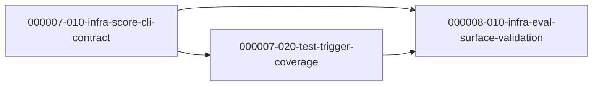

# Task Dependency Graph

## Batch

- Spec: `docs/ywc-plans/codex-toolkit-eval-improvements.md`
- Granularity mode: `llm`
- Starting phase: `000007`
- Rationale: existing completed tasks go through phase `000006`, so this batch starts at `000007`.

## Phase 000007 - Internal Evaluator Behavior

- `000007-010-infra-score-cli-contract` -> root
- `000007-020-test-trigger-coverage` -> depends on `000007-010-infra-score-cli-contract`

## Phase 000008 - Documentation Surface and Final Gate

- `000008-010-infra-eval-surface-validation` -> depends on `000007-010-infra-score-cli-contract`, `000007-020-test-trigger-coverage`

## Parallel Execution Notes

- Initial ready set: `000007-010-infra-score-cli-contract`
- After `000007-010-infra-score-cli-contract` merges: `000007-020-test-trigger-coverage` becomes runnable.
- After all Phase `000007` tasks merge: `000008-010-infra-eval-surface-validation` becomes runnable.
- `000007-010` and `000007-020` must not run in parallel because both may edit `tools/codex-internal/skills/ywc-codex-toolkit-eval/scripts/test_score.py`.
- `000008-010` must wait for both predecessors because it documents and validates their final behavior.

## Visual Dependency Graph

